import styles from './styles.css';

This post presents preliminary results of elaborating the idea that was [introduced on project's GitHub](https://github.com/orgs/replica-io/discussions/49#discussioncomment-12436415) and which can be referred to as _reversible deterministic concurrency_. We try to make those ideas a little more concrete and apply them to modelling some well-known distributed protocols.

<!-- Summary part ends here -->
<!--truncate-->

Designing, verifying, correctly implementing and later improving core mechanisms of complex distributed, decentralized systems, such as Byzantine fault tolerant consensus, is notoriously difficult and error-prone. One of the biggest challenges here is dealing with the inherently concurrent nature of distributed systems. So there is an underlying problem of structuring the inherently concurrent logic of distributed protocols that we don’t really know how to solve in a simple, flexible, and reliable way. Embarrassingly often, we approach this rather awkwardly and unsurprisingly end up with awfully complicated, obscure, and fragile code.

[Considering what modelling approach to initially adopt in the Replica_IO framework](https://github.com/replica-io/replica-io/issues/47), an approach that would allow _both specifying and implementing_ complex distributed protocols in a _natural_ way, I decided to challenge the status quo and try to rethink the conventional approaches to modeling distributed systems and the ways of expressing distributed protocols. So came up the idea of reversible deterministic concurrency. The idea was inspired by a number of [explored models of computation and programming models](https://github.com/replica-io/replica-io/issues/7), as well as some principles from information theory, modern physics, reversible and quantum computing, such as conservation of information.

The long-term goal is to develop this idea further into an approach for _specifying_ core mechanisms of concurrent, distributed systems, _implementing_ them in Rust code, as well as _verifying_ their correctness. The approach will be used as the foundation for the Replica_IO framework. Following this approach, it should be safe and easy to express concurrency and communication within the framework in a structured and composable way.

In order to get some intuition about the idea, we'll begin by discussing some basic principles behind it. Then we'll try modelling some well-known distributed protocols following those principles, namely the Bracha's reliable broadcast and the Tendermint consensus protocols.

Please bear in mind that this write-up is an early sketch and that many details of the approach presented here, including terminology, will likely undergo significant changes in the future.

## Approach

We conceptually think of concurrent systems as consisting of _deterministic_ components that can be connected with each other and interact _concurrently_. The only means of interaction with the components are through their _inputs_ and _outputs_. Each input and output can convey a certain type of data, and they are typed accordingly. Inputs and outputs matching in type can be connected _pairwise_, so that data can flow through the connection. Connecting inputs and outputs of different components enables data flow between those components.

### Base and composite components, extrinsic inputs and outputs

Components can be _composite_, i.e. consist of lower-level sub-components connected together. The remaining unconnected inputs and outputs become the inputs and outputs of the composite component. The process of decomposition bottoms out at _base components_ that are considered primitive and not decomposed further. Apart from base components, there can be _extrinsic inputs and outputs_ for exchanging information with the environment. The extrinsic inputs and outputs can represent interfaces for interacting with entities that are considered external to the modeled system, or they can be _sources_ of auxiliary data items and _sinks_ to dispose of excessive data.

### Input-output pairs, interaction lines, and two kinds of interaction

Inputs and outputs can only appear in complementary pairs. This applies to inputs and outputs of base components, and therefore of composite components, as well as to extrinsic inputs and outputs. Moreover, in a complete system, every input must be connected to exactly one output matching in type. So the input-output pairs connected one to another form a kind of chains or _interaction lines_. Data items flowing along different interaction lines can interact with each other by redistributing the information contained within those data items when they arrive at the same base component. So there are _two kinds of interaction_ within the system: passing data items from one component to another along interaction lines and exchange of information between data items on different interaction lines within base components.

### Determinism and reversibility

All components are conceptually _deterministic_: provided all the component's assumptions hold true, the output values must be completely determined by the input values and nothing else. Although the availability of output values can depend both on the availability of the input values and on the input values themselves, neither the output values nor their availability may per se depend on the relative order in which the input values become available. (It is worth noting here that this determinism is only conceptual: later we'll see how some input values may be left unspecified and, in normal operation, get chosen on spot, possibly depending on the availability and values of other inputs.) Moreover, the components must also be _reversible_, so that the original input values can always be recovered from the resulting output values.

One can view the determinism and reversibility requirements as a consequence of making all information flow within the system explicit. If all information that is used to determine the output values is contained in the input values then the inputs uniquely determine the outputs and the computation is deterministic. Similarly, if the output values collectively contain all the information that was contained in the original input values then the inputs can be recovered from the outputs and the computation is reversible. Determinism and reversibility are dual to each other: if a computation carried out in one direction is reversible then the same computation carried out in the opposite direction is deterministic.

Requiring that components are conceptually deterministic we make non-determinism explicit, structurally evident rather than emergent or accidental, while treating concurrency implicitly as emerging naturally from data availability and the system’s structure rather than from control flow. This should improve modularity and facilitate _compositional reasoning_. Together with the reversibility requirement this ensures that there is no hidden data flow, enables backward reasoning, backtracking mechanisms, _reverse debugging_ and would facilitate _management of resources_, such as memory.

### Simple components

#### Sum

We can represent components graphically. For example, the following figure depicts a component that simply adds one integer value to another:

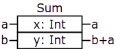

The component is represented by a rectangle divided into horizontal sections, one section for each input-output pair, i.e. interaction line. The component is labeled above by its name, `Sum`; its interaction lines are labeled as `x: Int` and `y: Int` , where `x` and `y` denote the names of the interaction lines and `Int` is the type of data items conveyed by them. The inputs are on the left side of the component whereas the outputs are on the right side. The component takes two integers as input values, denoted as `a` and `b`, along lines `x` and `y` and returns two integers as output values; the first input value goes through unchanged, whereas the second one becomes the sum of the two input values. The first input is required to determine both outputs, and the second input is required to determine the second output. Since this component has just two interaction lines, one of which leaves the value unchanged, we can alternatively depict it as follows:

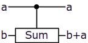

It is easy to see that this component is deterministic, i.e. the output values are completely determined by the input values, no matter in which order the inputs become available. It is also not hard to see that this component is reversible, i.e. the original input values can always be recovered from the resulting output values. We can depict the inverse of the component as follows:

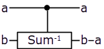

#### Generalized controlled swap

Let's consider another example. The following component represents a kind of generalized controlled swap operation[^fredkin-gate]:


or depicted alternatively:

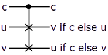

[^fredkin-gate]: Controlled swap of individual bits is known as [Fredkin gate](https://en.wikipedia.org/wiki/Fredkin_gate) in [reversible](https://en.wikipedia.org/wiki/Reversible_computing) and [quantum](https://en.wikipedia.org/wiki/Quantum_computing) computing; here we generalize it to operate on target values of arbitrary type.

It has three interaction lines: one control line, `c`, and two target lines, `t1` and `t2`. The value of the control line goes through unchanged, but it determines the output values of the target lines: If the control value is true then the values of the target lines get swapped, otherwise they simply go through unchanged. The controlled swap component is an inverse of itself.

### Concurrency of interaction lines

Interaction lines are highly _concurrent_: an output value becomes available as soon as it can be obtained from the input values that are available for the interaction. For example, in the `CSwap` component, once the value on the control line is available, each of the target outputs remains dependent only on one of the target inputs and becomes available as soon as that input value is available, concurrently and independently of each other.

### Demand-driven nature of interactions

Interactions are _demand-driven_: certain extrinsic inputs and some inputs of base components may demand a value from the connected output, and this demand propagates further along the inputs required to determine the demanded output value until it eventually reaches available values and triggers the interactions required to satisfy the demand. Sinks are never demanding, but they will consume the value when it becomes available.

### Unspecified values

Certain inputs of base components may be connected to special sources of _unspecified_ values. Those unspecified values are not real; they are just placeholders that stand for concrete values. During normal operation, the component will choose appropriate concrete values for such unspecified values and act as if they were guessed correctly and provided by the environment. When debugging the system or during verification, the sources of unspecified values can be forced to provide specific values; in that case, the component has no choice but to take the forced value as is. One can think of an unspecified value as a "superposition" of all possible values of the corresponding type that will "collapse" to a concrete value when going through the base component.

#### The `Def` component

The following component is meant to be used with such sources of unspecified values:

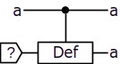

Both interaction lines of this component conceptually go through unchanged; however, if the value of the second input is unspecified, as denoted in the picture by the special source labeled with `?`, then the component chooses it to be equal to the value of the first input. This is effectively a way to copy the value of the first input in normal operation, but the second line can be forced to an arbitrary value, e.g. to model a Byzantine failure during verification. To avoid cluttering, we will often abbreviate the `Def` component in diagrams as follows:

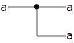

#### `CSwap` with unspecified control

The control line of the controlled swap component can also be left unspecified, e.g. as follows:

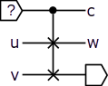

or in an abbreviated form:

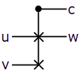

In the diagram above, the control line is connected to a source of unspecified values, and the second target output is connected to a sink (which is never demanding). When there is a demand for the first target output value, `w`, both of the target inputs will be demanded, and the demand for `w` will be satisfied by taking either `u` or `v`, whichever becomes available earlier, and the value of the control line will be chosen accordingly. If both target inputs are available when the target output is demanded then the value of the control line is chosen to be false, i.e. the component is biased towards passing the values of target lines through without swapping them.

### Synchronization

In some cases, we need to make sure that a certain value only becomes available if some other value also becomes available, without changing the values themselves. This can be achieved with the following synchronization primitive:

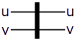

Values `u` and `v` go through the bar unchanged, but only once they both become available. Thus values `u` and `v` on the right side mean something more than those on the left side: a value becoming available on any line on the right side implies the existence and availability of some value on the other line as well.

### Signals

For similar reasons, it may also be useful to have a kind of _signalling_ interaction lines of unit type, which convey data items that can take only a single possible value. Such signal values themselves have no meaning other than their existence, i.e. availability. Signalling lines work naturally with synchronization bars:

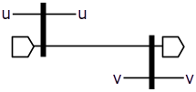

or in an abbreviated form:

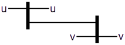

In the diagram above, values `u` and `v` go through unchanged, but `v` becomes available on the right side only when `u` becomes available. However, because there are separate synchronization bars and an additional signal line, the availability of `v` has no effect on the availability of `u`.

### Delays and timers

In order to represent time-dependent behavior of the system, we introduce the _delay_ component:

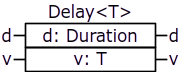

or alternatively:

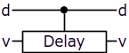

Values `d` and `v` go through the delay component unchanged, but, in normal operation, value `v` becomes available on the second output with a delay of at least time duration `d`.

Using the delay component, we can construct a timer component that passes an arbitrary value through the `trigger` line, and then, after a given amount of time provided on the `duration` line, lets a unit value to pass through the `signal` line (which would normally be connected to a source of an immediately available unit value):

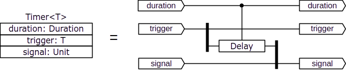

### One-shot and composite lines

Individual inputs and outputs, and therefore interaction lines composed thereof, are conceptually _one-shot_, i.e. they can convey only a single data item. However, we can bundle multiple inputs/outputs together and thus construct _composite inputs/outputs and interaction lines_. There is _no synchronization_ imposed by composing interaction lines together, i.e. each individual line remains _concurrent in composition_.

We can compose two interaction lines together and decompose them back by constructing and deconstructing a pair, graphically represented as follows:

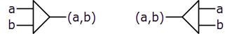

We can also uniformly bundle an arbitrary number of lines together as follows:

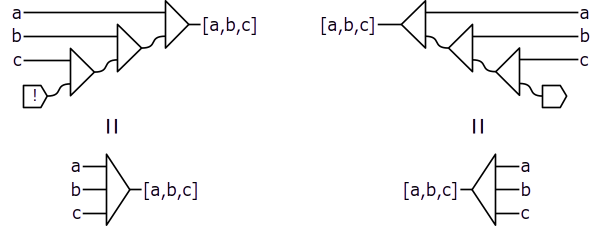

In the diagram above, the source labeled with the bang symbol `!` denotes an empty source. (With just two lines being multiplexed uniformly, the notation above appears the same as the one for constructing a pure pair; in such cases, the ambiguity will be resolved by the context.)

Using this notation, we can also bundle a virtually indefinite number of lines together:

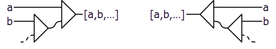

Note that the line composition primitives are not components: there is neither interaction nor synchronization between individual interaction lines caused by the composition; this is just notational convenience for dealing with multiple interaction lines.

### Transposition

It may be useful to rearrange the elements within a composition. We can transpose the last two levels of a composition as follows:

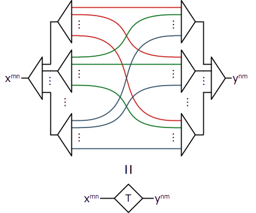

The transposer connects line $x_{i,j}$ from composite line $x^{mn}$ on the left to line $y_{j,i}$ of composite line $y^{nm}$ on the right. For example, it will rearrange

```
[ [u, v, w], [x, y, z] ]
``` 

into 

```
[ [u, x], [v, y], [w, z] ]
```

### The `Select` component

Using composite interaction lines we can define a component representing a choice from an arbitrary number of options:

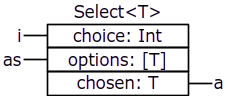

In the `Select` component, the first input, `choice`, determines the value of which element from the second, composite input, `options`, should become available on the third output, `chosen`. The `chosen` input is supposed to be connected to a source of unspecified values. The `choice` input can also be left unspecified; in that case, the component chooses it to select the element of `options` that becomes available earlier.

### Uncluttering diagrams

To unclutter diagrams, we may depict several connections in one stroke and omit sources of unspecified values and sinks like this:

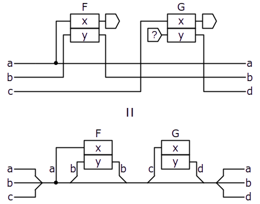

### Repetitive patterns

#### Replication box

We would often need to connect one or many components in a repetitive pattern. To represent such patterns in a diagram, we can depict a single instance of the repeating part of the diagram enclosed in a _replication box_:

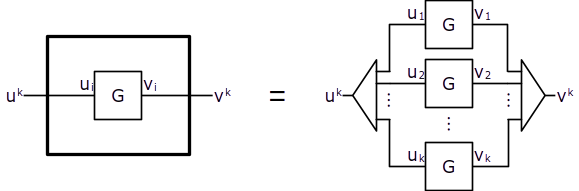

In the diagram above, component `G` enclosed in a replication box is virtually repeated for each element of the composite lines entering and exiting the replication box.

#### Recursive loops

We can use the replication box to represent recursive patterns of connections as follows:


### Domains and projections

Each interaction line belongs to a certain _domain_, which characterizes its location. For example, we can define a separate domain for each node of a distributed system. Interaction lines cannot cross domain boundaries, but _some components may span multiple domains_ and thus enable _cross-domain interaction_.

We can then derive a _projection_ of a system model onto a subset of its domains. Connections with base components that span the projection boundary will be represented as extrinsic inputs and outputs. So we can project a model of the whole distributed system separately onto each node and derive the local logic of individual nodes. The base components that represent means of communication between nodes, which are necessarily cross-domain, will be replaced by extrinsic inputs and outputs standing for gateways to the networking layer.

### Assume-guarantee reasoning and modelling of faults

The behavior of individual components could be specified in terms of the assumptions about their inputs and the guarantees about their outputs. This would enable _assume-guarantee reasoning_ about correctness of the system and _compositional verification_. In the context of distributed systems, benign node faults can be modeled by suppressing some extrinsic sources belonging to the corresponding domains, whereas Byzantine faults can be modeled by forcing some of the extrinsic sources with arbitrary values ("garbage in — garbage out").

### Confining interaction lines

The total number of interaction lines in complex components can quickly become too large. Therefore, components should only expose a subset of input-output pairs that is enough to guarantee determinism and reversibility under the component's assumptions, _confining_ the remaining interaction lines by connecting them to sources and sinks inside the component. For example, in distributed protocols, the exact set of votes forming a valid quorum for certain decisions of the protocol logic often does not affect the outcomes, given the assumptions about the maximal fraction of faulty nodes hold true; so the corresponding interaction lines can be confined within a component representing the protocol.

## Modelling Distributed Protocols

### Bracha's Reliable Broadcast

Now we'll try to apply the approach to modelling a relatively simple distributed protocol, namely Bracha's broadcast[^bracha-broadcast]. Bracha's broadcast is a foundational distributed protocol implementing a Byzantine fault-tolerant reliable broadcast mechanism in the asynchronous model. The protocol allows one party to broadcast a message such that all correct parties eventually deliver the message and agree on the delivered message, given that less than a third of the parties may be corrupt. The protocol adopts the asynchronous model, i.e. it makes no timing assumptions but requires that every message sent by a correct process is eventually received.

[^bracha-broadcast]: To learn about Bracha's broadcast in detail, please refer to the [original paper](https://ecommons.cornell.edu/bitstream/handle/1813/6430/84-590.pdf), where it was introduced as a key building block of an asynchronous consensus protocol. The following post may also be helpful: [Living with Asynchrony: Bracha's Reliable Broadcast](https://decentralizedthoughts.github.io/2020-09-19-living-with-asynchrony-brachas-reliable-broadcast/), as well as [these lecture notes](https://dcl.epfl.ch/site/_media/education/sdc_byzconsensus.pdf).

For the sake of simplicity, we will model a one-shot version of the protocol that only allows broadcasting a single value from a designated sender party. The protocol can be expressed in traditional event-oriented pseudo-code as follows:

```
upon broadcast(m): // only sender
	send message <SEND, m> to all

upon receiving a message <SEND, m> from the sender:
	send message <ECHO, m> to all

upon receiving n-f messages <ECHO, m> and not having sent a READY message:
	send message <READY, m> to all

upon receiving f+1 messages <READY, m> and not having sent a READY message:
	send message <READY, m> to all

upon receiving n-f messages <READY, m>:
	deliver(m)
```

#### Peer-to-peer links

We will start by modelling communication between individual nodes in the system. Each party in the protocol is represented by a node, and each node is modeled as a separate domain. For the nodes to communicate, those domains need to be able to interact through some kind of cross-domain component. So we define the following component for that purpose:

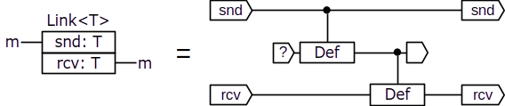

The `Link` component allows sending an authenticated value from one node to another. If the `rcv` input is left unspecified, as supposed, the component chooses the value from the `snd` input as the value of the `rcv` output.  The `snd` line belongs to the message sender's domain, whereas the `rcv` line belongs to the destination node's domain. If we treat `Link` as a composite component, we can model it as shown on the right side of the diagram above, where the internal interaction line in the middle belongs to a separate domain and represents the communication medium.

#### Weak broadcast

Although the underlying communication mechanism is point-to-point message exchange, if we look closer, the basic communication pattern used in the reliable broadcast protocol is sending the same message to all nodes. Let's refer to this pattern as weak broadcast and represent it as the following component:


The `bc` line belongs to the sending node's domain, whereas the elements of the composite `dlvr` line belong to the corresponding receiving nodes' domains. We can model a corrupt sender committing the failure of message equivocation (sending different messages to some receivers) by forcing some of the sources in its domain with arbitrary values. The component is mainly composed of `Link` and `Def` components replicated for each receiving node. The `Def` components are meant to create an individual copy of the `bc` value for each instance of `Link`. Note the recursive pattern, used together with the replication box, that forms a kind of forward loop in order to thread the value from the `bc` input through the replicated components.

#### Quorums

Another kind of component that we will need is for collecting quorums of values received from peer nodes:


The `WeakQuroum` and `StrongQuorum` components are identical except the number of votes required to reach the quorum: `f+1` and `n-f`, respectively. `WeakQuorum` ensures that there is at least one vote from a correct node, whereas `StrongQuorum` ensures that any two of such quorums must intersect in at least one correct node. Moreover, `StrongQuorum` ensures that any of its quorums contains at least as many votes from correct nodes as the total number of votes required by `WeakQuorum`. The `votes` line represents the values received from peer nodes, whereas the `value` line represents the value supported by a sufficient quorum of votes. If the `value` input is left unspecified then the component will choose the value corresponding to the earliest quorum of votes becoming available; if the `value` input is forced then the component will make the complementary output available only once a quorum becomes available on the `votes` input.

#### Overall protocol model

Now we can model the Bracha's reliable broadcast protocol as a cross-domain component with an interface identical to `WB` but providing the guarantees of reliable broadcast:

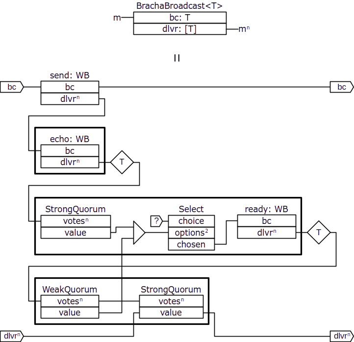

In this diagram, we omit sources of unspecified values and sinks. We also omit types, but indicate the dimentionality of composite lines. We label the instances of the  `WB` component with names: `send`, `echo`, and `ready`, indicating the kind of protocol message being communicated through those components.

The `send` component is used to send a value from the designated sender node to all nodes, whereas the `echo` and `ready` components are replicated for each node and represent all-to-all communication. Note that the composite `dlvr` outputs of the `WB` components replicated for each node sending `ECHO` and `READY` messages go through transposers outside of replication boxes. Remember that individual lines of the `dlvr` output belong to the corresponding receiving nodes' domains, but we need to connect the `votes` inputs of the quorum components so that they all belong to the same node's domain. The trasnposers rearrange the composite lines to achieve that.

The `Select` component, replicated for each node, represents a choice between two alternative causes for sending a `READY` message: either upon receiving a strong quorum of `ECHO` messages or upon receiving a weak quorum of `READY` message from other nodes.

#### Consistent broadcast and modularized protocol model

We should recognize that a part of this reliable broadcast protocol actually represents a consistent broadcast protocol. Consistent broadcast guarantees that receivers agree on the delivered values, but it does not guarantee that all correct receivers eventually deliver the value even if some correct receivers deliver. We can represent this sub-protocol as a cross-domain component:

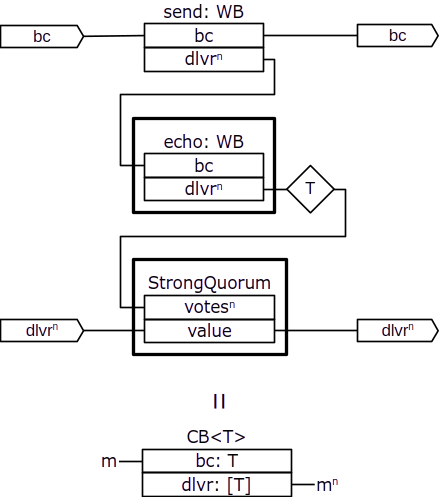

and then restructure the reliable broadcast protocol as follows:

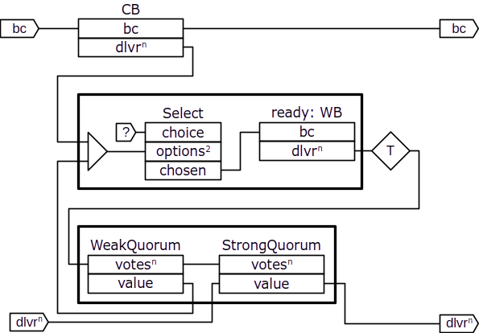

### Tendermint Consensus

Now we'll try to apply the approach to a more complicated protocol and sketch a model of the Tendermint consensus protocol[^tendermint]. Tendermint is a Byzantine fault-tolerant sequence consensus protocol (a.k.a. total order broadcast or atomic broadcast), which allows nodes to agree on a single growing sequence of values where values can be proposed by different nodes. The protocol adopts the partially synchronous model, i.e. it assumes that eventually all messages are delivered within certain time bound, although there might be periods of asynchrony in the system. The timing assumptions complicate modelling by adding more non-determinism and appear in the protocol in a form of timeouts.

[^tendermint]: For a more precise and detailed description of the Tendermint protocol please refer to the [original paper](https://arxiv.org/pdf/1807.04938).

#### Gossip communication

The Tendermint protocol relies upon a gossip-based mechanism for communication between nodes: a node can broadcast a message through the gossip mechanism and it will be delivered at all correct nodes. Moreover, if a correct node delivers a message from the gossip mechanism then the same message is guaranteed to be delivered at all other correct nodes. We will model this communication mechanism as the following cross-domain component:

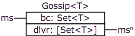

The `bc` line belongs to the sending node and represents the set of values broadcast through this instance of the gossip mechanism; each element of the `dlvr` line belongs to the corresponding receiving node and represents the set of values delivered from that instance of the gossip mechanism.

Individual elements in the `Set` type are concurrent and can become available independently of each other. We can think of the `Set<T>` type as a composition of single-bit lines, each representing the presence or absence of a particular value of `T` in the set.

If the `bc` line belongs to a correct node then the same set of values becomes available on all elements of the `dlvr` output that belong to correct nodes as the set of values on the `bc` input. Moreover, if any value becomes available on one element of `dlvr` of a correct node then the same value also becomes available on all correct nodes' elements of `dlvr`.

Correct nodes in the Tendermint protocol only ever broadcast a single value through each instance of the `Gossip` component; however, Byzantine nodes may broadcast multiple values and all correct nodes would eventually deliver all of those values from that instance of the `Gossip` component.

#### Overall protocol model

Nodes in the Tendermint protocol decide on a single value at each _height_ in the growing sequence of values. At each height, the protocol may need one or multiple _rounds_ in order to reach agreement between nodes and determine the decision value to _commit_ at that height. Each round consists of the _proposal_, _prevote_, and _precommit_ stages. So we can model the overall protocol as the following cross-domain component:

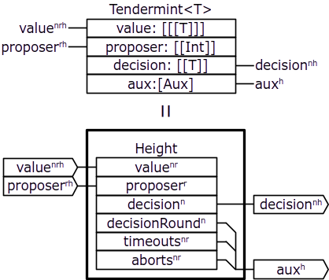

Here, again, we omit sources of unspecified values and sinks, omit most of the types, but indicate the dimentionality of composite lines with superscript indeces.

The `Tendermint` component represents the overall protocol. Its composite `value` input represents the values that would be proposed by each node (index `n`) in each round (index `r`) at each height (index `h`); the `proposer` input represent the designated proposer for each round at each height; the `decision` output represents the decision value by each node at each height. Finally, the composite `aux` line represents the auxiliary lines added for each height in order to satisfy the determinism and reversibility requirements.

The `Height` component represents the protocol logic for each height. Its interaction lines are mostly identical to those of the `Tendermint` component, without the last level of composition, except that the auxiliary line is represented more explicitly. Namely, the `aux` line of `Tendermint` is composed of the following lines of `Height`: `decisionRound` representing the round number in which each nodes commits the decision value, `timeouts` and `aborts` representing timeouts and aborts happened at each node in each round.

#### `Height` component

We model the `Height` component as follows:


The `Round` component represents a single instance of the repetitive part of the protocol that includes the proposal, prevote, and precommit stages, in which a designated proposer broadcasts a proposal proposing a decision value to all nodes who can then broadcast prevote and precommit votes for the proposed value. At each node, instead of voting for the proposal, the prevote and precommit stages may timeout, in which case the node broadcasts a special `nil` vote, or abort, in which case the node does not broadcast any vote in that stage of the round; the propose stage can also abort. As we'll see later, the rounds and stages are coordinated by the signals from the `pmSignals` input. Those signals are required for the round stages to broadcast a proposal or vote, to timeout, or to abort. The actual timeout and abort decisions are represented by the `timeouts` and `aborts` lines.

The Tendermint protocol defines certain conditions that a proposal must satisfy in order to be voted for. Those conditions depend on the outcomes of the previous round, so there is a forward loop, represented by the `loopFwd` line, that connects successive instances of the replicated `Round` component and conveys the required values from the previous to the next round.

The `Commit` component represents the decision logic of the protocol that is replicated for each node. Given the proposal and precommit votes from each round, it determines the single decision by selecting the value proposed in one of the rounds, the decision round, for which there exists a strong quorum of matching precommit votes.

The `Pacemaker` component coordinates the rounds and stages of the protocol by making the corresponding signals available according to the required dynamics of the protocol. We'll see those signals connected to the corresponding components in the next diagram.

#### `Round` component

We model the `Round` component as follows:


The `Propose`, `Prevote`, and `Precommit` components represent the stages of the protocol logic and determine the values of the corresponding messages to broadcast through the gossip mechanism. `Prevote` and `Precommit` are replicated so that there are individual instances for each node. Note that there are separate instances of the `Gossip` component for each node and stage, except for the proposal that is broadcast only by the designated proposer node, and those instances are replicated in the overall protocol component for each round and height. This way, there is no need to include the message tag, height and round numbers in the values that are broadcast through the `Gossip` component instances. The composite lines representing all-to-all communication go through transposers outside of the replication boxes in order to rearrange their components appropriately.

The `validVR` and `lockedVR` are composite lines representing `(validValue, validRound)` and `(lockedValue, lockedRound)`, respectively, with the values corresponding to the variables of the same name from the protocol pseudo-code as it is described in the original paper[^tendermint]. Basically, `validVR` is used to determine whether the proposer should propose a new value or re-propose a value proposed in one of the previous rounds, `lockedVR` determines which proposals are safe to cast a prevote for. As we can see from the diagram, the values in those lines are updated in the `Precommit` component. The `prevoteQVals` line is a composite line each element of which corresponds to the prevote, if any, supported by a strong quorum in the previous rounds. Note how the `prevoteQVals` and `round` lines are updated for each node in a replication box: the composite `prevoteQVals` line is extended with an additional line connected to the corresponding output of the `Precommit` component, whereas `round` is simply incremented by the component labeled with `+1`.

We will not decompose the components further since the main point was to make a sketch of how we can model the overall structure of the Tendermint protocol, namely the heights, rounds, stages, the interconnection between them, and represent the dynamics of the protocol.

## Conclusion

We explored a possible way of applying the ideas of reversible deterministic concurrency to modelling distributed protocols. We tried to make the vague ideas a little more concrete and give a better intuition of how an approach based on those ideas may look like by considering some guiding principles, spelling out some details, introducing some primitives and patterns, expressing this in a graphical notation. We considered modelling distributed systems as a whole and then deriving local projections for individual nodes. We also considered how we can model node failures, both benign and Byzantine. Finally, we saw how some concrete, well-known distributed protocols may look like when modeled following this approach.

We also anticipated some potential benefits of the approach, such as modularity, composability, compositional reasoning and verification, absence of hidden data flows, enhanced debugging and verification methods, resource management, representing a distributed system as a whole and then deriving the logic and implementation for its local nodes.

This is just the beginning of developing those ideas into a practical solution. We'll need to see what this approach means for different aspects of designing and implementing distributed protocols. We'll need to invent some kind of textual notation and develop a clear, consistent concept codifying the core principles. We'll need to find a way of implementing those ideas in real code and examine its expressivity and limitations, better understand the benefits and drawbacks. In other words, we need to find a good way of turning this into a solid foundation for our framework.

import Admonition from '@theme/Admonition';

<Admonition type="info" icon="❤️" title="Supporting">
If you like the project and find it valuable, please <a href="https://github.com/sponsors/replica-io">support</a> its further development! 🙏
</Admonition>
